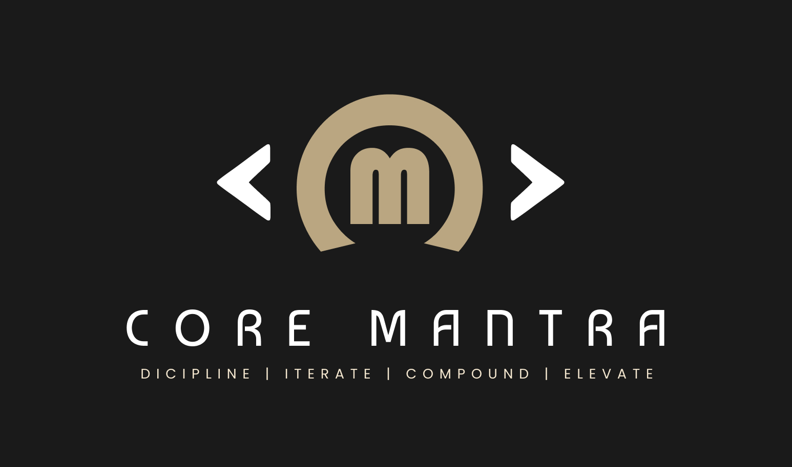

# Core Mantra

A powerful **Claude Code plugin** that layers a compounding outer loop over lifecycle commands, grounded in a strong discipline engine.

It transforms how you work with AI coding agents by making every engineering cycle more effective than the last; enforcing quality, learning from outcomes, and building momentum through structured iteration.

## 60-second quickstart

```bash
/plugin marketplace add C0DERAI/core-mantra
/plugin install core-mantra
```

Then in any project:

```
/chant-mantra "add dark mode toggle to settings page"
```

Core Mantra picks a mode (`lite` / `standard` / `full`), detects the phase (`brainstorm` → `spec` → `plan` → `build` → `review` → `ship`), and runs it — pausing at approval gates.

## Commands

| Command | Purpose |
|---------|---------|
| `/chant-mantra <intent>` | Auto-router. Runs the right phase(s). |
| `/mantra:ideate` | Surface improvement ideas |
| `/mantra:brainstorm` | Refine an idea |
| `/mantra:spec` | Write the design spec |
| `/mantra:plan` | Write the TDD plan |
| `/mantra:build` | Execute the plan |
| `/mantra:test` | Run and expand tests |
| `/mantra:debug` | Systematic debugging |
| `/mantra:simplify` | Code-health pass |
| `/mantra:review` | Multi-agent review |
| `/mantra:ship` | Final gate + PR |
| `/mantra:compound` | Capture learnings |

## Docs

- [INSTALL](docs/INSTALL.md)
- [USAGE](docs/USAGE.md)
- [ARCHITECTURE](docs/ARCHITECTURE.md)
- [CONTRIBUTING](docs/CONTRIBUTING.md)
- [CREDITS](CREDITS.md)

## License

MIT.
